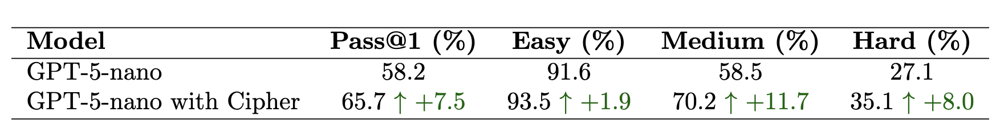
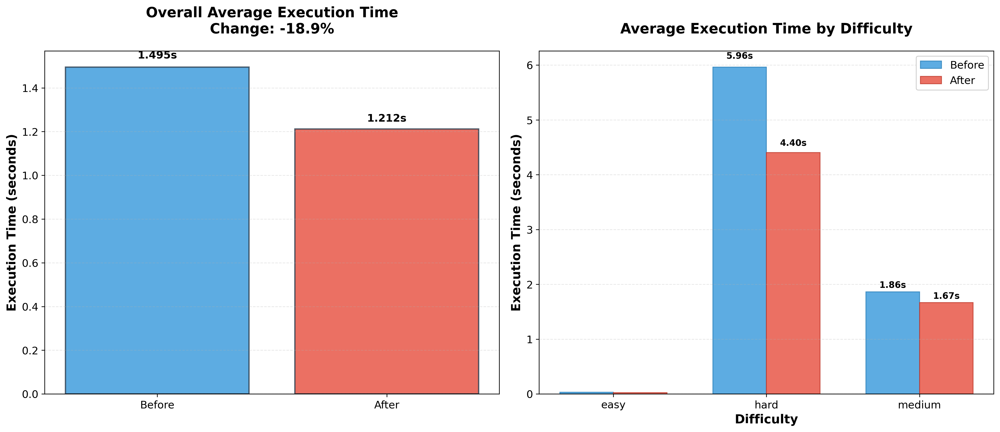
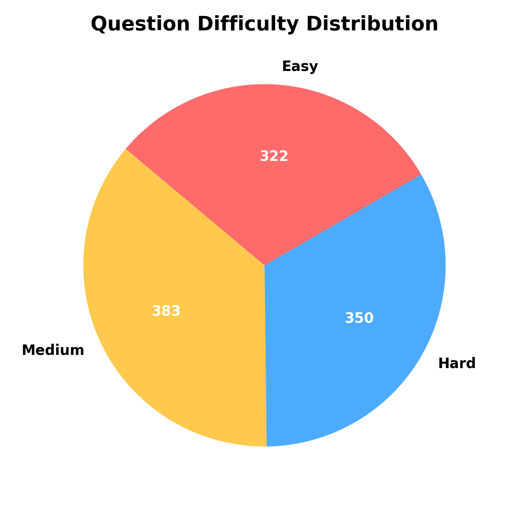
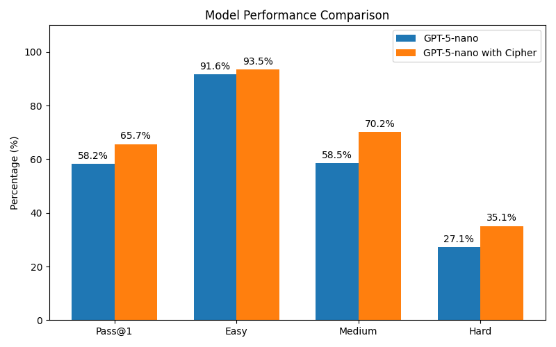

# LiveCodeBench with Cipher
A official benchmark repo of Cipher Agentic Memory Layer with LiveCode Benchmark

## Introduction
LiveCodeBench provides holistic and contamination-free evaluation of coding capabilities of LLMs. This workspace includes LiveCodeBench directly, pre-wired to support Cipher’s memory workflow (Milvus/Zilliz) and popular LLM providers.


## Plots
Visualizations in `plots/`:










## Installation
You can clone the repository using the following command:

```bash
git clone https://github.com/willingWill17/LiveCodeBench.git
cd LiveCodeBench
```

We recommend using uv for managing dependencies:

```bash
uv venv --python 3.11
source .venv/bin/activate
uv pip install -e .
```

Alternatively with pip:

```bash
python3 -m venv .venv
source .venv/bin/activate
pip install -e .
```

## Environment
This repo’s default runner configuration uses Gemini-compatible OpenAI SDK with a Gemini base URL.

Set your provider API key (for Gemini):

```bash
export GEMINI_API_KEY="<your_api_key>"
```

If you switch models/providers, configure credentials accordingly and ensure the model is supported in `lcb_runner/lm_styles.py`.

## Data
We provide benchmark scenarios:
- Code Generation: `https://huggingface.co/datasets/livecodebench/code_generation_lite`
- Code Execution: `https://huggingface.co/datasets/livecodebench/execution`
- Test Output Prediction: `https://huggingface.co/datasets/livecodebench/test_generation`

## Inference and Evaluation
LiveCodeBench supports comprehensive evaluation across multiple scenarios with extensive configuration options.

### Basic Evaluation Commands

#### Code Generation Evaluation
```bash
python -m lcb_runner.runner.main \
  --model gemini-2.5-pro \
  --scenario codegeneration \
  --evaluate \
  --n 10 \
  --temperature 0.2
```

- `--model`: model name defined in `lcb_runner/lm_styles.py` (e.g., `gemini-2.5-pro`, `claude-3-sonnet`, `gpt-4o`, `deepseek-coder`)
- `--scenario codegeneration`: run code generation evaluation
- `--evaluate`: compute evaluation metrics
- `--n`, `--temperature`: sampling controls

#### Code Execution Evaluation
```bash
python -m lcb_runner.runner.main --model gemini-2.5-pro --scenario codeexecution --evaluate
```

#### Test Output Prediction
```bash
python -m lcb_runner.runner.main --model gemini-2.5-pro --scenario testoutputprediction --evaluate
```

### Memory Implementation
#### With defined knowledge base
Populate memory from prior evaluation results and then run with retrieval.

1) Build reasoning memory entries into Milvus:

```bash
python build_reasoning.py \
  --input_file output/GPT-5-Nano/Scenario.codegeneration_1_0.2_eval_all.json \
  --model gemini-2.5-pro \
  --embedding_model gemini-embedding-001 \
  --collection_name memory
```

Notes:
- Defaults in `build_reasoning.py` point to a sample input file and a default collection `memory`.
- You can control the processing via `--max_threads`, `--debug`, `--dry_run`, index range filters, etc.

2) Evaluate with memory retrieval enabled:

```bash
python -m lcb_runner.runner.main \
  --model gemini-2.5-pro \
  --scenario codegeneration \
  --evaluate \
  --use_memory \
  --local_dataset_path data/divided_data_gpt_5_nano
```

#### With on-going learning
Will be implemented soon.

### Plotting 
### Advanced Evaluation Parameters
Performance and resource management:

```bash
# Parallelism and timeouts
--num_process_evaluate 12          # evaluation processes (default: 12)
--timeout 6                        # per-eval timeout seconds (default: 6)
--openai_timeout 90                # provider API timeout (default: 90)

# Memory and caching options
--use_cache                        # Enable result caching
--cache_batch_size 100             # Cache batch size (default: 100)
--multiprocess 0                   # Number of generation processes (default: 0)
--max_concurrent_threads 20        # Max concurrent API threads (default: 20)
```

Model-specific configuration:

```bash
# Local model support
--local_model_path /path/to/model  # local HF model path
--trust_remote_code                # trust remote code for HF models

# VLLM options
--tensor_parallel_size 1           # tensor parallel size
--enable_prefix_caching            # enable prefix caching
--dtype bfloat16                   # dtype (default: bfloat16)
```

Benchmark configuration:

```bash
# Versioning and filtering
--release_version release_v2       # use a specific benchmark version
--not_fast                         # use full test set (slower)
--start_date 2023-09-01            # filter by start date (YYYY-MM-DD)
--end_date 2024-03-31              # filter by end date (YYYY-MM-DD)
--local_dataset_path /path/to/data # local dataset directory
```

Continuation and recovery:

```bash
--continue_existing                # continue from existing generations
--continue_existing_with_eval      # continue and reuse existing evals
```

### Evaluation Metrics
- pass@1: correct on first attempt
- pass@5: correct within 5 attempts
- pass@10: correct within 10 attempts

Notes:
- Time limits can cause slight variations (< 0.5 points)
- Adjust `--num_process_evaluate` and `--timeout` if you see performance variance

### Time-Window Analysis

```bash
# Compute scores for problems released after a specific date
python -m lcb_runner.evaluation.compute_scores --eval_all_file {saved_eval_all_file} --start_date 2023-09-01

# Compute scores for a specific time window
python -m lcb_runner.evaluation.compute_scores --eval_all_file {saved_eval_all_file} --start_date 2023-09-01 --end_date 2024-03-31

# Filter by platform (LeetCode, AtCoder, CodeForces)
python -m lcb_runner.evaluation.compute_scores --eval_all_file {saved_eval_all_file} --platform leetcode
```

### Output Files
- `{model_name}_{scenario}_{params}.json`: raw model generations
- `{model_name}_{scenario}_{params}_eval.json`: evaluation summary
- `{model_name}_{scenario}_{params}_eval_all.json`: per-problem detailed results

### Best Practices
1. Start with `--debug` to test a small subset (15 problems)
2. Monitor resources and tune `--num_process_evaluate`
3. Enable `--use_cache` for repeated runs
4. Use `--continue_existing` to resume interrupted runs
5. Inspect the `_eval_all.json` file for per-problem details

### Example Evaluation Workflow

```bash
# 1) Quick debug run
python -m lcb_runner.runner.main --model gemini-2.5-pro --scenario codegeneration --evaluate --debug

# 2) Full evaluation with tuned settings
python -m lcb_runner.runner.main --model gemini-2.5-pro --scenario codegeneration --evaluate \
  --n 10 --temperature 0.2 --num_process_evaluate 8 --use_cache

# 3) Analyze contamination-free performance for recent problems
python -m lcb_runner.evaluation.compute_scores \
  --eval_all_file output/GEMINI_codegeneration_10_0.2_eval_all.json \
  --start_date 2023-09-01
```

## Citation

```bibtex
@article{jain2024livecodebench,
  author    = {Naman Jain, King Han, Alex Gu, Wen-Ding Li, Fanjia Yan, Tianjun Zhang, Sida Wang, Armando Solar-Lezama, Koushik Sen, Ion Stoica},
  title     = {LiveCodeBench: Holistic and Contamination Free Evaluation of Large Language Models for Code},
  year      = {2024},
  journal   = {arXiv preprint},
}
```
